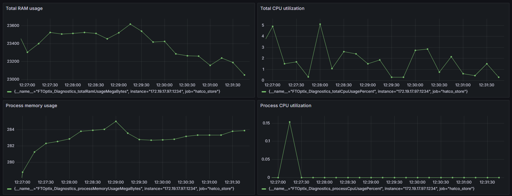

# Metric Logic

This project contains a `Metric_Logic` class that exposes various system and process metrics using Prometheus. The metrics are exposed on `http://localhost:1234/metrics`.



## Cloning the repository

There are multiple ways to download this project, here is the recommended one

### Clone repository

1. Click on the green `CODE` button in the top right corner
2. Select `HTTPS` and copy the provided URL
3. Open FT Optix IDE
4. Click on `Open` and select the `Remote` tab
5. Paste the URL from step 2
6. Click `Open` button in bottom right corner to start cloning process

## Prerequisites

- FactoryTalk Optix 1.5.x or later (`.NET8` is required)
- .NET Core SDK
- Prometheus

### NuGet packages

The following packages have to be installed (if not automatically restored by FactoryTalk Optix)

- Microsoft.Extensions.ObjectPool (Version 8.0.10)
- prometheus-net (Version 8.2.1)
- System.Diagnostics.PerformanceCounter (Version 8.0.1)

## Configuration

### Allow FTOptixRuntime Access to Port 1234

To allow FTOptixRuntime access to port 1234 without administrator privileges, run the following command in the terminal (as Administrator):

```bash
netsh http add urlacl url=http://+:1234/ user=Everyone
```

### Prometheus Configuration

Add the following scrape configuration to your Prometheus configuration file (`prometheus.yml`):

```txt
scrape_configs:
  - job_name: 'ftoptix_metrics'
    static_configs:
    - targets: ['ipaddress:1234']

```

## Metrics Exposed

The following metrics are exposed:

- `FTOptix_Model_Variable1`: Variable1 from Model folder
- `FTOptix_Diagnostics_totalCpuUsagePercent`: Total CPU usage percent
- `FTOptix_Diagnostics_totalRamUsageMegaBytes`: Total RAM utilization in MB
- `FTOptix_Diagnostics_processCpuUsagePercent`: CPU usage percent of the current process
- `FTOptix_Diagnostics_processMemoryUsageMegaBytes`: Memory usage of the current process in MB

## Code Overview

### Metric_Logic Class

- **Start Method**: Initializes and starts the metrics server on port 1234 and starts a periodic task to refresh the metrics.
- **Stop Method**: Disposes of the periodic task and metrics server.
- **MetricsMethod**: Refreshes the memory and CPU metrics and updates the Prometheus gauges.

### CpuUsage Class

- **GetCpuUsageForProcess**: Retrieves the CPU usage for the current process, with platform-specific implementations for Windows, Linux, and macOS.
- **GetTotalCpuUsage**: Retrieves the total CPU usage, with platform-specific implementations for Windows, Linux, and macOS.

### MemoryUsage Class

- **GetProcessMemoryUsage**: Retrieves the memory usage of the current process.
- **GetTotalMemoryUsage**: Retrieves the total memory usage, with platform-specific implementations for Windows, Linux, and macOS.

## Running the Code

1. Build and run the project.
2. Access the metrics at `http://ipaddress:1234/metrics`.

### Monitoring with dotnet-counters

You can also monitor the metrics using `dotnet-counters`:

```bash
dotnet-counters monitor -n FTOptixRuntime --counters [metric name]
```

Replace `[metric name]` with the name of the metric you want to monitor.

### Logging

Errors during metric refresh are logged using the `Log.Error` method.

## Sample Grafana + Prometheus stack

```yaml
services:
  # Grafana is used to create cool visualizations
  grafana:
    image: grafana/grafana
    container_name: grafana
    ports:
      - 3000:3000
    restart: unless-stopped
    environment:
      - GF_SECURITY_ADMIN_USER=admin
      - GF_SECURITY_ADMIN_PASSWORD=SomeComplexPassword
    volumes:
      - grafana:/etc/grafana/provisioning/datasources
      - grafana_db:/var/lib/grafana
  # Prometheus is the metrics ingestion software
  prometheus:
    image: prom/prometheus
    container_name: prometheus
    command:
      - '--config.file=/etc/prometheus/prometheus.yml'
    ports:
      - 9090:9090
    restart: unless-stopped
    volumes:
      - prom_etc:/etc/prometheus
      - prom_data:/prometheus
  # Ubuntu is only used to get easy access to the configuration folders
  ubuntu:
    image: ubuntu:latest
    container_name: grafana_ubuntu
    stdin_open: true
    tty: true
    volumes:
      - prom_etc:/etc/stack/prometheus_etc
      - prom_data:/etc/stack/prometheus_data
      - grafana:/etc/stack/grafana_sources
      - grafana_db:/etc/stack/grafana_db
      
volumes:
  grafana:
  grafana_db:
  prom_etc:
  prom_data:
```

## Disclaimer

Rockwell Automation maintains these repositories as a convenience to you and other users. Although Rockwell Automation reserves the right at any time and for any reason to refuse access to edit or remove content from this Repository, you acknowledge and agree to accept sole responsibility and liability for any Repository content posted, transmitted, downloaded, or used by you. Rockwell Automation has no obligation to monitor or update Repository content

The examples provided are to be used as a reference for building your own application and should not be used in production as-is. It is recommended to adapt the example for the purpose, observing the highest safety standards.
